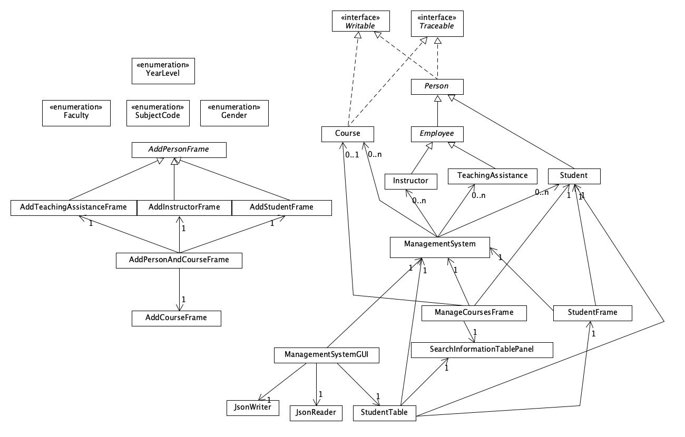

# Student Management System
___

As a student, I interact with the learning management system every day (from a student's side).
And I always wonder what the Admin's side looks like and how does the system work. Therefore, in this project, I will
develop a student management system for schools or institutions at a college or university level.  
In light of the pandemic, the system has COVID-19 contact tracing implemented. Make sure everyone stays **safe** and **healthy**. 
### What does it do
___
#### *Functionality* list:
- Be able to **modify** or **add** a student's grades and courses 
- View and search a specific student in the database 
- Sort and rank students by their grades in a given course
- Generate and format a student's transcript and export it as a **_PDF_** file
- Export students' grades to worksheets (E.g Excel) 

### Who uses Student Management System
___
### Here are some potential users of this application:

#### Organizations
- Public Schools (Universities, Colleges or other institution)
- Virtual Schools

#### Individuals
- Teachers
- Professors
- Administrators

## User Stories
___
As a user, I want to...
- [x] Be able to **add** people(students, instructors and TAs) and courses to the system
- [X] Be able to **modified**, **update** and **delete** students
- [x] **View** students in the system
- [x] Sort and rank students in _ascending_ or _descending_ order by their GPAs
- [X] View students' grades and make **modifications**
- [x] Notify all the people that have direct or indirect contact with COVID-19
- [x] Export and load system via a JSON file
---
### Phase 4: Task 2  
Sample output: 
> [Student 14778] has been added to the system  
> Course [Italian Studies] section <1> has been added to the system  
> [Instructor 15161] has been added to the system  
> [TA 14944] has been added to the system  
> [Student 16978] has been removed from the system  
> [Student: 11592] Course: INDS | Grade changed from (53%) to (99%)  
> [Student 19764] is being withdrawn from [Course ASL 2]  
> [Student 19764] is being added to a new [Course FSCT section 8]  
      
### Phase 4: Task 3  
_UML Diagram_  
Improvements that can be made:
- **ManagementSystem** class should contain a list of **Person** instead of **Instructor**, **TA** and **Student**
- Use Observer and Observable pattern in GUI and **ManagementSystem**.  
So when a new student is added to the system, it will notify the studentTable to insert an extra row
- Combine StudentTable and StudentFrame into one class
